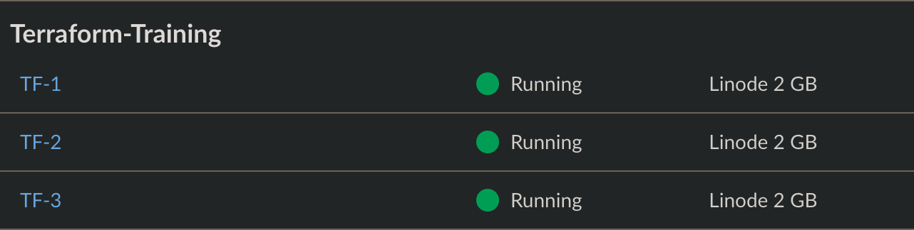
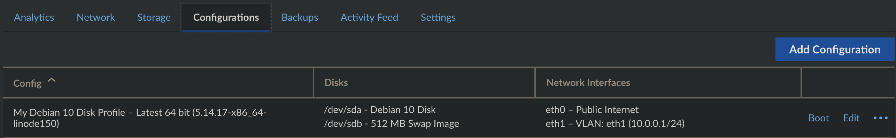
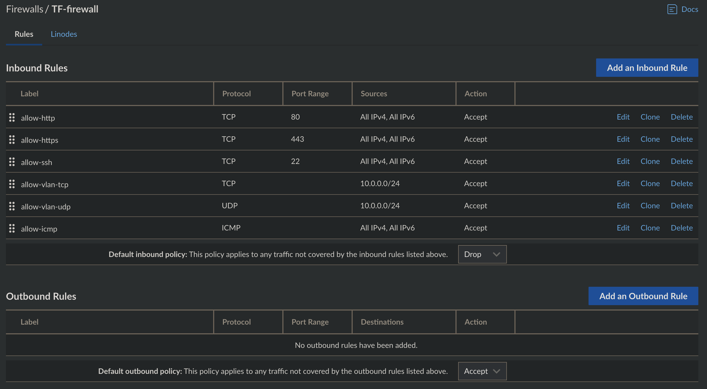
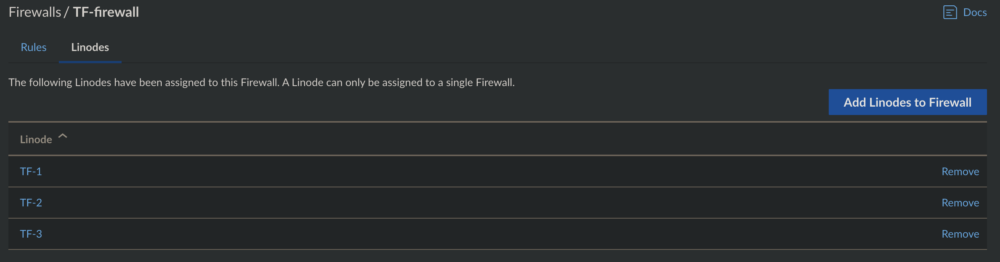
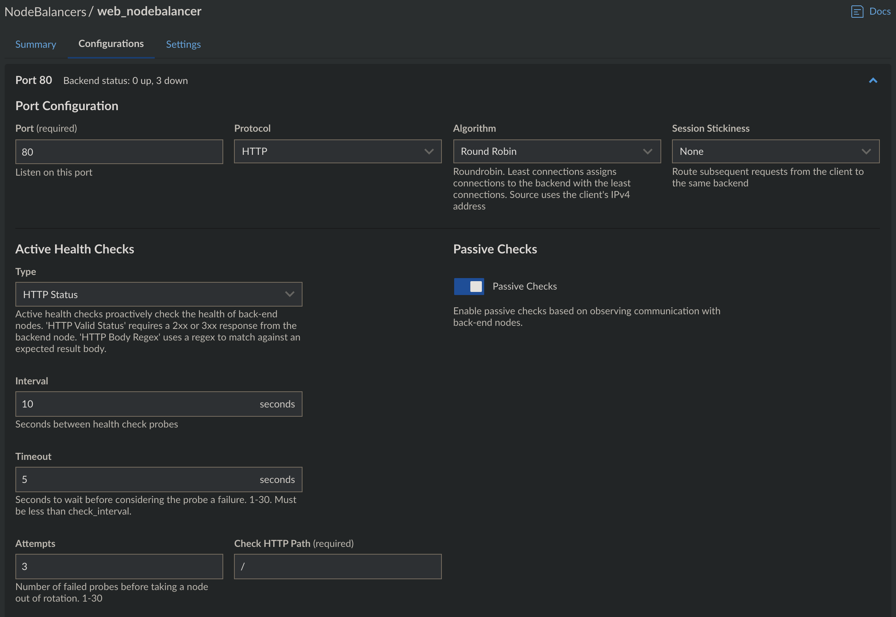
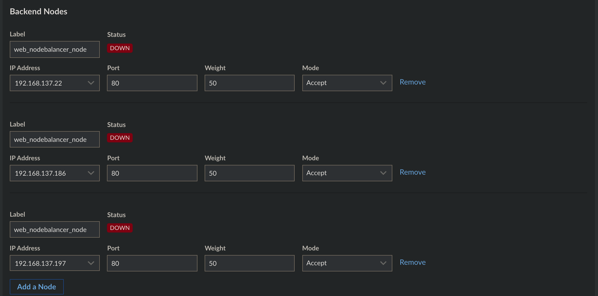
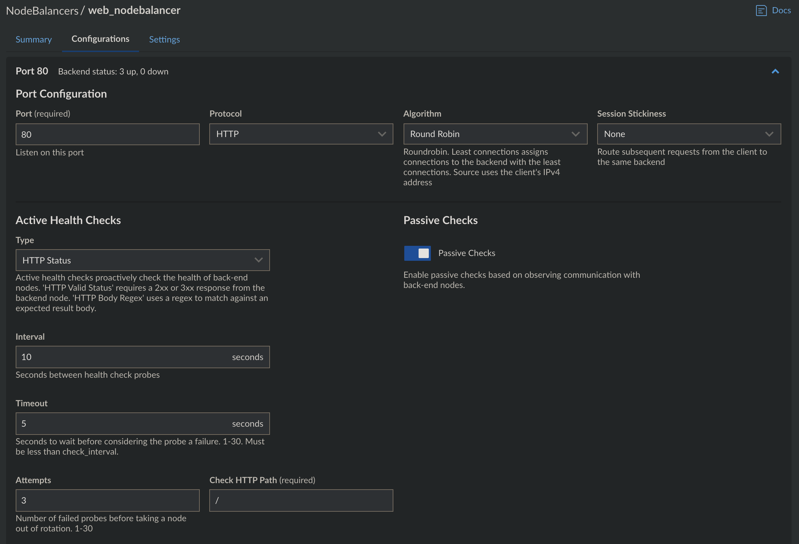
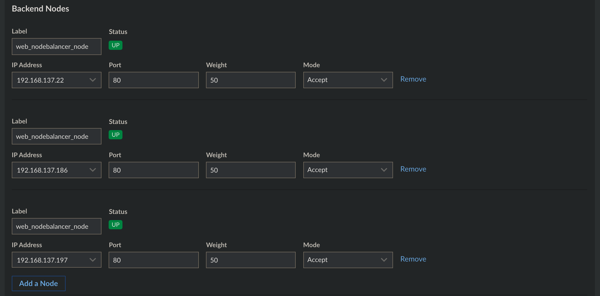
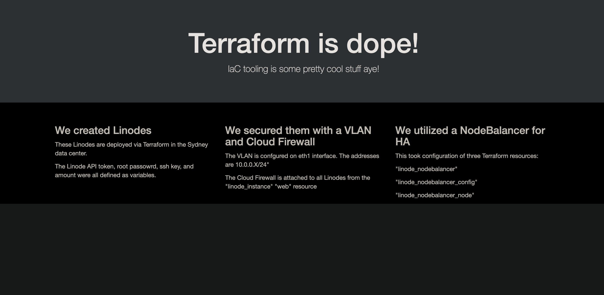
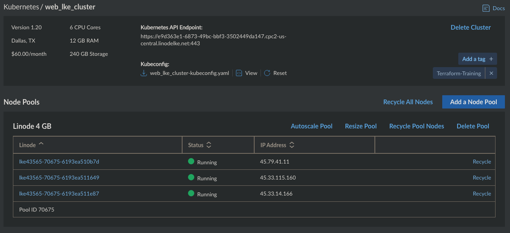

# Terraform training

## Part 1:
### Getting started

Install VS Code and Terraform:
```
brew install visual-studio terraform ansible
```
Crate a new `ssh` key pair to use with Terraform.
```
ssh-keygen -o -a 100 -t ed25519 -C "terraform" -f "${HOME}/.ssh/id_terraform_ed25519" -q -N "" <<<y >/dev/null
```

Create a Linode API token in the [Cloud Manager](https://www.linode.com/docs/guides/getting-started-with-the-linode-api/#get-an-access-token), copy it, and then type the following to save it in a temporary location.
```
pbpaste > /tmp/tf.key
```

Generate a random root password to use with Terraform.
```
openssl rand -base64 32 > /tmp/tf.pw
```

### Into to Terraform
Analyze the Terraform files in the `terraform_project` directory. The `main.tf` file contains the main set of configuration for your module.
```
provider "linode" {
  token = var.api_token
}

resource "linode_instance" "web" {
  count = var.amount
  image = "linode/debian10"
  label = "TF-${count.index + 1}"
  group = "terraform_group"
  tags = ["Terraform-Training"]
  region = var.region
  type = "g6-standard-1"
  authorized_keys = [ var.authorized_keys ]
  root_pass = var.root_pass
}
```

Notice these are linode instance parameters, and we substituted four values with variables:
- token = `var.api_token` - Your Linode API token
- count = `var.amount` - The number of Linodes to stand up
- region = `var.region` - The region to deploy Linodes
- authorized_keys = `[ var.authorized_keys ]` - Your public ssh key to put in the `authorized_keys` file.
- root_pass = `var.root_pass` - Root password for Linodes

This demonstrates how we can use variables in the `main.tf` file. We can declare variables and any defaults in this same file under the `resource` block, or we can organize them in a separate `variables.tf` file. 
```
variable "authorized_keys" {
  default = "ssh-ed25519 AAAAC3NzaC1lZDI1NTE5AAAAIG925acs9OB9+u1XKZmJRcZ4KIQjzIQAUZ2lGSAoSn6X bthompson@linode.com"
}

variable "region" {
  default = "ap-southeast"
}

variable "amount" {
  default = "3"
}

variable "api_token" {}

variable "root_pass" {}
```

Then place the values in a `terraform.tfvars` file. Putting sensitve values here will make Terraform mask them when displaying output in the terminal (displayed as "sensitive value").
```
api_token = "<YOUR_API_TOKEN>"
root_pass ="<YOUR_ROOT_PASSWORD>"
```

At this point the Linode IDs of our future instances are still to be determined, so let's configure a `outputs.tf` file to display them after Terraform executes successfully. 
```
output "linode_id" {
    value = linode_instance.web.*.id
}
```

Using the Terraform CLI, initialize your project.
```
terraform init
```

Verify that Terraform will create the resources as expected.
```
terraform plan
```

A successful plan looks something like the output below.
```
Terraform used the selected providers to generate the following execution plan. Resource actions are indicated with the following symbols:
  + create

Terraform will perform the following actions:

  # linode_instance.web[0] will be created
  + resource "linode_instance" "web" {
      + authorized_keys    = [
          + "ssh-ed25519 AAAAC3NzaC1lZDI1NTE5AAAAIG925acs9OB9+u1XKZmJRcZ4KIQjzIQAUZ2lGSAoSn6X bthompson@linode.com",
        ]
      + backups            = (known after apply)
      + backups_enabled    = (known after apply)
      + boot_config_label  = (known after apply)
      + group              = "terraform_group"
      + id                 = (known after apply)
      + image              = "linode/debian10"
      + ip_address         = (known after apply)
      + ipv4               = (known after apply)
      + ipv6               = (known after apply)
      + label              = "TF-1"
      + private_ip_address = (known after apply)
      + region             = "ap-southeast"
      + root_pass          = (sensitive value)
      + specs              = (known after apply)
      + status             = (known after apply)
      + swap_size          = (known after apply)
      + tags               = [
          + "Terraform-Training",
        ]
      + type               = "g6-standard-1"
      + watchdog_enabled   = true

      + alerts {
          + cpu            = (known after apply)
          + io             = (known after apply)
          + network_in     = (known after apply)
          + network_out    = (known after apply)
          + transfer_quota = (known after apply)
        }
    }

  # linode_instance.web[1] will be created
  + resource "linode_instance" "web" {
      + authorized_keys    = [
          + "ssh-ed25519 AAAAC3NzaC1lZDI1NTE5AAAAIG925acs9OB9+u1XKZmJRcZ4KIQjzIQAUZ2lGSAoSn6X bthompson@linode.com",
        ]
      + backups            = (known after apply)
      + backups_enabled    = (known after apply)
      + boot_config_label  = (known after apply)
      + group              = "terraform_group"
      + id                 = (known after apply)
      + image              = "linode/debian10"
      + ip_address         = (known after apply)
      + ipv4               = (known after apply)
      + ipv6               = (known after apply)
      + label              = "TF-2"
      + private_ip_address = (known after apply)
      + region             = "ap-southeast"
      + root_pass          = (sensitive value)
      + specs              = (known after apply)
      + status             = (known after apply)
      + swap_size          = (known after apply)
      + tags               = [
          + "Terraform-Training",
        ]
      + type               = "g6-standard-1"
      + watchdog_enabled   = true

      + alerts {
          + cpu            = (known after apply)
          + io             = (known after apply)
          + network_in     = (known after apply)
          + network_out    = (known after apply)
          + transfer_quota = (known after apply)
        }
    }

  # linode_instance.web[2] will be created
  + resource "linode_instance" "web" {
      + authorized_keys    = [
          + "ssh-ed25519 AAAAC3NzaC1lZDI1NTE5AAAAIG925acs9OB9+u1XKZmJRcZ4KIQjzIQAUZ2lGSAoSn6X bthompson@linode.com",
        ]
      + backups            = (known after apply)
      + backups_enabled    = (known after apply)
      + boot_config_label  = (known after apply)
      + group              = "terraform_group"
      + id                 = (known after apply)
      + image              = "linode/debian10"
      + ip_address         = (known after apply)
      + ipv4               = (known after apply)
      + ipv6               = (known after apply)
      + label              = "TF-3"
      + private_ip_address = (known after apply)
      + region             = "ap-southeast"
      + root_pass          = (sensitive value)
      + specs              = (known after apply)
      + status             = (known after apply)
      + swap_size          = (known after apply)
      + tags               = [
          + "Terraform-Training",
        ]
      + type               = "g6-standard-1"
      + watchdog_enabled   = true

      + alerts {
          + cpu            = (known after apply)
          + io             = (known after apply)
          + network_in     = (known after apply)
          + network_out    = (known after apply)
          + transfer_quota = (known after apply)
        }
    }

Plan: 3 to add, 0 to change, 0 to destroy.
```

You can optionally pass `-out <file>` to the `terraform plan` command to save the plan to a file, and use `terraform show` to inspect the plan before applying. This may be preferred to avoid accidentally destroying/modifying resources.
```
terraform plan -out linode-plan
terraform show linode-plan
```

If all looks good, `apply` the plan! Terraform will proceed with exactly the steps outlined in the plan file. In the absence of a plan file, it will prompt the user for approval.
```
terraform apply linode-plan
```

### Add VLAN
To update the linodes to use VLANs, we need to do more than the basic configuration/deployment. The Linode Terraform provider allows us to use explicit disks and configs. They are both required to use the `interface` block for the VLAN configuration. Update your `main.tf` file to match the below example.
```
provider "linode" {
  token = var.api_token
}

#linodes
resource "linode_instance" "web" {
  count = var.amount
  #image = "linode/debian10"
  label = "TF-${count.index + 1}"
  group = "terraform_group"
  tags = ["Terraform-Training"]
  region = var.region
  type = "g6-standard-1"
  private_ip = true

  disk {
    label = "Debian 10 Disk" # required
    size = 50688 
    image  = "linode/debian10"
    authorized_keys = [ var.authorized_keys ]
    root_pass = var.root_pass
  }

  disk {
    label = "512 MB Swap Image" # required
    size = 512
    filesystem = "swap"
  }

  config {
    label = "My Debian 10 Disk Profile" # required
    devices {
      sda {
        disk_label = "Debian 10 Disk"
      }
      sdb {
        disk_label = "512 MB Swap Image"
      }
    }
    interface {
      purpose = "public"
      label = ""
    }
    interface {
      purpose = "vlan"
      label = "eth1"
      ipam_address = "10.0.0.${count.index + 1}/24"
    }
  }
}
```

Notice that the `image`, `authorized_keys`, and `root_pass` parameters were moved into the `disk` block, instead of the root of the `linode_instance` resource. We also have to explicitly create and size each disk, as well as create the configuration profile for the Linode to boot from. Terraform will destroy and rebuild these Linodes, since this process requires rebuilding the disks. We'll writ this plan to a new file titled `linode-vlan-plan` and then `apply` if everything looks as we want it.
```
terraform plan
terraform apply
```

### Add Cloud Firewall
Now we're going to add another resource block that configures a Cloud Firewall and then attaches it to the three Linodes. Append the the below to the `main.tf` file, `plan it`, and `apply` it.
```
# firewall
resource "linode_firewall" "web_firewall" {
  label = "TF-firewall"
  tags  = ["Terraform-Training"]

  inbound {
    label    = "allow-http"
    action   = "ACCEPT"
    protocol = "TCP"
    ports    = "80"
    ipv4     = ["0.0.0.0/0"]
    ipv6     = ["::/0"]
  }

  inbound {
    label    = "allow-https"
    action   = "ACCEPT"
    protocol = "TCP"
    ports    = "443"
    ipv4     = ["0.0.0.0/0"]
    ipv6     = ["::/0"]
  }

  inbound {
    label    = "allow-ssh"
    action   = "ACCEPT"
    protocol = "TCP"
    ports    = "22"
    ipv4     = ["0.0.0.0/0"]
    ipv6     = ["::/0"]
  }

  inbound {
    label    = "allow-vlan-tcp"
    action   = "ACCEPT"
    protocol = "TCP"
    ipv4     = ["10.0.0.0/24"]
  }

  inbound {
    label    = "allow-vlan-udp"
    action   = "ACCEPT"
    protocol = "UDP"
    ipv4     = ["10.0.0.0/24"]
  }

  inbound {
    label    = "allow-icmp"
    action   = "ACCEPT"
    protocol = "ICMP"
    ipv4     = ["0.0.0.0/0"]
    ipv6     = ["::/0"]
  }

  inbound_policy = "DROP"
  outbound_policy = "ACCEPT"

  linodes = linode_instance.web.*.id
}
```
```
terraform plan
terraform apply
```

### Add NodeBalancer

Alrighty! Let's put the three Linodes behind a NodeBalancer! This requires defining three more `resources` as well, one to create the NodeBalancer instance, one for its configuration, and another known as a **_"NodeBalancer Node"_** resource that ties everything together. You can think of this as the part that defines the relationship between the nodes, NodeBalancer and it's configuration.

```
# nodebalancer
resource "linode_nodebalancer" "web_nodebalancer" {
    label = "web_nodebalancer"
    region = var.region
}

resource "linode_nodebalancer_config" "web_nodebalancer_config" {
    nodebalancer_id = linode_nodebalancer.web_nodebalancer.id
    port = 80
    protocol = "http"
    check = "http"
    check_path = "/"
    check_attempts = 3
    check_timeout = 5
    check_interval = 10
    stickiness = "http_cookie"
    algorithm = "roundrobin"
}

resource "linode_nodebalancer_node" "web_nodebalancer_node" {
    count = var.amount
    nodebalancer_id = linode_nodebalancer.web_nodebalancer.id
    config_id = linode_nodebalancer_config.web_nodebalancer_config.id
    address = "${element(linode_instance.web.*.private_ip_address, count.index)}:80"
    label = "web_nodebalancer_node"
    weight = 50
}
```
```
terraform plan
terraform apply
```
### Config Management
You will notice the NodeBalancer is reporting that all nodes are **_down_**. Well, that's because we haven't installed and configured a web server on them yet. Let's change that! We'll define some commands to install and configure `nginx` on our Linodes, by using `provisioners`. These are used to execute commands either locally (`local-exec`), on the remote nodes (`remote-exec`), or to copy files to the remote nodes (`file`). We could define these provisioners within the `resource`, but for this example we'll put them in a `null_resource` at then end of our `main.tf` file. A `null_resource` allows us to configure connection details and provisioners, and run those provisioners without being directly associated with another resource.

> Note: Terraform documentation states that [Provisioners are a Last Resort](https://www.terraform.io/docs/language/resources/provisioners/syntax.html), and they recommend [cloud-init](https://learn.hashicorp.com/tutorials/terraform/cloud-init?in=terraform/provision&utm_source=WEBSITE&utm_medium=WEB_IO&utm_offer=ARTICLE_PAGE&utm_content=DOCS) or [packer](https://learn.hashicorp.com/tutorials/terraform/packer?in=terraform/provision&utm_source=WEBSITE&utm_medium=WEB_IO&utm_offer=ARTICLE_PAGE&utm_content=DOCS) for configuration management.
```
# configure web nodes
resource "null_resource" "install_nginx" {
  count = var.amount
  provisioner "file" {
    source      = "nginx/index.html"
    destination = "/tmp/index.html"

    connection {
      type = "ssh"
      user = "root"
      agent = "true"
      host = "${element(linode_instance.web.*.ip_address, count.index)}"
    }  
  }

    provisioner "file" {
    source      = "nginx/example.com.conf"
    destination = "/tmp/example.com.conf"

    connection {
      type = "ssh"
      user = "root"
      agent = "true"
      host = "${element(linode_instance.web.*.ip_address, count.index)}"
    }  
  }

  provisioner "remote-exec" {
    inline = [
      "apt update",
      "mkdir -p /var/www/html",
      "apt -y install nginx",
      "mv /tmp/index.html /var/www/html/index.html",
      "chown -R www-data: /var/www/html/",
      "mv /tmp/example.com.conf /etc/nginx/sites-available/example.com.conf",
      "cd /etc/nginx/sites-enabled/",
      "ln -s ../sites-available/example.com.conf example.com.conf",
      "systemctl restart nginx"
    ]
    connection {
      type = "ssh"
      user = "root"
      agent = "true"
      host = "${element(linode_instance.web.*.ip_address, count.index)}"
    }  
  }  
}
```
```
terraform plan
terraform apply
```

The Linode way to do the above would be to use a StackScript with the `linode_instance` resource. Below is an [example](https://www.linode.com/docs/guides/deploy-a-wordpress-site-using-terraform-and-linode-stackscripts/#examining-the-terraform-configuration) of that looks like.
> Note: This is just an example of adding stackscript parameters to the `linode_instance` resource. We did not configure the variables for this, and thus we are not doing it as part of this lab. I repeat, the below is just an example - DO NOT add this to your `main.tf`.
```
#linodes
resource "linode_instance" "web" {
  count = var.amount
  #image = "linode/debian10"
  label = "TF-${count.index + 1}"
  group = "terraform_group"
  tags = ["Terraform-Training"]
  region = var.region
  type = "g6-standard-1"
  private_ip = true

  disk {
    label = "Debian 10 Disk" # required
    size = 50688 
    image  = "linode/debian10"
    authorized_keys = [ var.authorized_keys ]
    root_pass = var.root_pass
    stackscript_id = 12345
    stackscript_data = {
      "ssuser" = var.stackscript_data["ssuser"]
      "hostname" = var.stackscript_data["hostname"]
      "website" = var.stackscript_data["website"]
      "dbuser" = var.stackscript_data["dbuser"]
      "db_password" = var.stackscript_data["db_password"]
      "sspassword" = var.stackscript_data["sspassword"]
      "dbuser_password" = var.stackscript_data["dbuser_password"]
    }
  }

  disk {
    label = "512 MB Swap Image" # required
    size = 512
    filesystem = "swap"
  }

  config {
    label = "My Debian 10 Disk Profile" # required
    devices {
      sda {
        disk_label = "Debian 10 Disk"
      }
      sdb {
        disk_label = "512 MB Swap Image"
      }
    }
    interface {
      purpose = "public"
      label = ""
    }
    interface {
      purpose = "vlan"
      label = "eth1"
      ipam_address = "10.0.0.${count.index + 1}/24"
    }
  }
}
```

### Combining with Ansible
Terraform use to provide support for vendor provisioners, including Ansible, Chef, Puppet, Salt, etc. Newer versions of Terraform have deprecated them, since they on making you use packer instead. TO use Ansible with Terraform, you can either have packer call Ansible playbooks, or the `local-exec` provisioner that we mentioned earlier. The latter is what we're doing below.
```
# ansible provisioner
resource "null_resource" "ansible" {
  count = var.amount
  provisioner "local-exec" {
  command = "ANSIBLE_HOST_KEY_CHECKING=False ansible-playbook -i '${element(linode_instance.web.*.ip_address, count.index)},' -e 'pub_key=${var.authorized_keys}' ansible/install.yml"

    connection {
      type = "ssh"
      user = "root"
      agent = "true"
      host = "${element(linode_instance.web.*.ip_address, count.index)}"
    }  
  }
}
```
```
terraform plan
terraform apply
```

Is that all? Hell naw!! Let's deploy an LKE cluster while we're at it. Append the below resource to your `main.tf` file.
```
# lke cluster
resource "linode_lke_cluster" "web_lke_cluster" {
    label       = "web_lke_cluster"
    k8s_version = "1.20"
    region      = var.region
    tags        = ["Terraform-Training"]

    pool {
        type  = "g6-standard-2"
        count = 3
    }
}
```
```
terraform plan
terraform apply
```
## Part 2:
### Terraform Modules
By now you'll notice that the `main.tf` file is starting to get long. It will start to become strenuous and increasingly less manageable the more we add to it from here. This is where **modules** come to the rescue! We can modularize all of this into more digestible, bite size chunks that are simple to manage and **reusable**. You might not see the night and day difference in this example, but as your infrastructure grows and becomes more complex, you most certainly will! 

Up this point we've been working from the `terraform_project` directory. From here forward we'll be working in the `terraform_modules_project` directory instead. Navigate there and analyze the files. You should see a directory tree structure like the example below.

```
terraform_modules_project/
├── ansible
├── main.tf
├── modules
│   ├── firewall
│   ├── linodes
│   ├── lke
│   ├── nodebalancer
│   └── provisioners
├── nginx
├── providers.tf
├── terraform.tfvars
└── variables.tf
```

> Note: The `ansible` and `nginx` directories can be ignored for now, as they just contain the files we'll use later for the `null_resource` provisioners.

This is a basic structure of a modularized Terraform project. Just like before, we have `variables.tf`, `terraform.tfvars`, `provider.tf` and `main.tf` files. You can see the `modules` directory contains subdirectories for the individual (and reusable) modules. The `main.tf` seen here will serve as the root module for our project. This is where we'll call individual modules from the `modules` directory.
```
# terraform_modules_project/main.tf

provider "linode" {
    token = var.api_token
}
```

Each module in the `modules` directory will also need its own `main.tf`, `variables.tf`, and `provider.tf` files. We also need an `outputs.tf` for **just** the `linodes` module.
```
terraform_modules_project/modules/
├── firewall
│   ├── main.tf
│   ├── provider.tf
│   └── variables.tf
├── linodes
│   ├── main.tf
│   ├── provider.tf
│   └── variables.tf
├── lke
│   ├── main.tf
│   ├── outputs.tf
│   ├── provider.tf
│   └── variables.tf
├── nodebalancer
│   ├── main.tf
│   ├── provider.tf
│   └── variables.tf
└── provisioners
    ├── main.tf
    ├── provider.tf
    └── variables.tf
```

Here is what the full structure from the project **root** should look like at this point.
```
terraform_modules_project/
├── ansible
├── main.tf
├── modules
│   ├── firewall
│   │   ├── main.tf
│   │   ├── provider.tf
│   │   └── variables.tf
│   ├── linodes
│   │   ├── main.tf
│   │   ├── outputs.tf
│   │   ├── provider.tf
│   │   └── variables.tf
│   ├── lke
│   │   ├── main.tf
│   │   ├── provider.tf
│   │   └── variables.tf
│   ├── nodebalancer
│   │   ├── main.tf
│   │   ├── provider.tf
│   │   └── variables.tf
│   └── provisioners
│       ├── main.tf
│       ├── provider.tf
│       └── variables.tf
├── nginx
├── providers.tf
├── terraform.tfvars
└── variables.tf
```

Configure every `provider.tf` file the same.
```
terraform {
  required_providers {
    linode = {
      source = "linode/linode"
    }
  }
  required_version = ">= 0.13"
}
```

### Linodes Module
Now let's configure the `linodes` module first! Define the `linode_instance` resource in `./modules/linodes/main.tf`.
```
# terraform_module_project/modules/linodes/main.tf

# depoly linodes
resource "linode_instance" "web" {
  count = var.amount
  label = "TF-${count.index + 1}"
  group = "terraform_group"
  tags = ["Terraform-Training"]
  region = var.region
  type = "g6-standard-1"
  private_ip = true

  disk {
    label = "Debian 10 Disk" # required
    size = 50688 
    image  = "linode/debian10"
    authorized_keys = [ var.authorized_keys ]
    root_pass = var.root_pass
  }

  disk {
    label = "512 MB Swap Image" # required
    size = 512
    filesystem = "swap"
  }

  config {
    label = "My Debian 10 Disk Profile" # required
    devices {
      sda {
        disk_label = "Debian 10 Disk"
      }
      sdb {
        disk_label = "512 MB Swap Image"
      }
    }
    interface {
      purpose = "public"
      label = ""
    }
    interface {
      purpose = "vlan"
      label = "eth1"
      ipam_address = "10.0.0.${count.index + 1}/24"
    }
  }
}
```

Then let's define `variables.tf` with the variables this module needs as input values. If a default is not given, and no value is assigned to these variables via the root module, the user will be prompted for the value when running `terraform plan`.

```
# terraform_modules_project/modules/linodes/variables.tf 

variable "authorized_keys" {}

variable "region" {
  default = "ap-southeast"
}

variable "amount" {
  default = "3"
}

variable "api_token" {}

variable "root_pass" {}
```

The `outputs.tf` file in this case does more than just output information about Linodes to the screen when we run `terraform apply`. It's also provides a way to pass that information to other modules we call after - information such as the Linode Ids, IPv4 addresses, etc. By outputting the `linode_instance.web` objects, we can index them and access their attributes. For example, the below `outputs.tf` enables us to extract the Linode ID from the first Linode object, and use it from within a different module by referencing `linode_web_instance.0.id`.
```
# terraform_module_project/modules/linodes/outputs.tf

output "linode_web_instances" {
  value = linode_instance.web
}
```

We are now ready to **source** the `linodes` module into our root module. Note that we are assigning `root_passs`, `api_token`, and `authorized_keys` variables. That's because they were declared in the `./modules/linodes/variables.tf` file as inputs, but didn't contain a default value. There are however, some default values for these variables in the top-level `variables.tf`, so we have to assign them here.
```
# terraform_modules_project/main.tf

provider "linode" {
    token = var.api_token
}

module "linodes" {
    source = "./modules/linodes"
    root_pass = var.root_pass
    api_token = var.api_token
    authorized_keys = var.authorized_keys
}
```

Run a `terraform plan` to ensure everything works as expected, and then `terraform apply`. You should see the three Linodes deploy to your account. Each should have an `eth1` interface configured for the VLAN we defined.




### Firewall Module
Let's set up the `firewall` module next! Recall what was mentioned earlier about the `outputs.tf` of the `linodes` module, and how it makes the Linode instance information available to other modules. That information is available in an object we defined as `linode_web_instances`. To use it in our `firewall` module we'll assign it to a variable in the root module. Let's call it `firewall_linodes` to make it distinguishable from other variables and clear on what it's for. Add the following `module` block to the **root module**.
```
module "firewall" {
    source = "./modules/firewall"
    firewall_linodes = "${module.linodes.linode_web_instances}"
}
```

Since we're assigning a `firewall_linodes` variable, we need to declare it in `/modules/firewall/variables.tf`.
```
# terraform_modules_project/modules/firewall/variables.tf 

variable "firewall_linodes" {}
```

Now put the remaining HCL to configure our firewall in `./modules/firewall/main.tf`.
```
# terraform_module_project/modules/firewall/main.tf

# firewall
resource "linode_firewall" "web_firewall" {
  label = "TF-firewall"
  tags  = ["Terraform-Training"]

  inbound {
    label    = "allow-http"
    action   = "ACCEPT"
    protocol = "TCP"
    ports    = "80"
    ipv4     = ["0.0.0.0/0"]
    ipv6     = ["::/0"]
  }

  inbound {
    label    = "allow-https"
    action   = "ACCEPT"
    protocol = "TCP"
    ports    = "443"
    ipv4     = ["0.0.0.0/0"]
    ipv6     = ["::/0"]
  }

  inbound {
    label    = "allow-ssh"
    action   = "ACCEPT"
    protocol = "TCP"
    ports    = "22"
    ipv4     = ["0.0.0.0/0"]
    ipv6     = ["::/0"]
  }

  inbound {
    label    = "allow-vlan-tcp"
    action   = "ACCEPT"
    protocol = "TCP"
    ipv4     = ["10.0.0.0/24"]
  }

  inbound {
    label    = "allow-vlan-udp"
    action   = "ACCEPT"
    protocol = "UDP"
    ipv4     = ["10.0.0.0/24"]
  }

  inbound {
    label    = "allow-icmp"
    action   = "ACCEPT"
    protocol = "ICMP"
    ipv4     = ["0.0.0.0/0"]
    ipv6     = ["::/0"]
  }

  inbound_policy = "DROP"
  outbound_policy = "ACCEPT"

  linodes = var.firewall_linodes.*.id
}
```

> Note the `linodes = var.firewall_linodes.*.id` line above. This is where we attached the firewall to the Linode IDs that we extracted from the `firewall_linodes` variable, which has the value of the `linode_web_instances` object.

Run `terraform plan` to verify those Linode IDs will be attached, and then `terraform apply`!




### NodeBalancer Module
Time to put these Linodes behind a NodeBalancer! Add another `module` block for it in the root module. Like with the `firewall` module, we need to pass information from the instances created in the `linodes` module, because the `nodebalancer` module needs to make configurations for those backends. We'll assign the `linode_web_instances` object, but to a distinguishable variable called `backend_linodes`. You also see that we're using the `amount` variable - the value of which gets assigned to [`count`](https://www.terraform.io/docs/language/meta-arguments/count.html). We have a default value of `3` assigned to `amount` in the top-level `variables.tf`, so let's assign it here along with the `linode_web_instances` object.
```
module "nodebalancer" {
    source = "./modules/nodebalancer"
    backend_linodes = "${module.linodes.linode_web_instances}"
    amount = var.amount
}
```

Also like the `firewall` module, we need to declare these variables as inputs via the module's local `variables.tf` - this process will repeat for all modules we use in this exercise. Add the following to `.modules/nodebalancer/variables.tf`.
```
# terraform_module_project/modules/nodebalancer/variables.tf

variable "backend_linodes" {}

variable "amount" {}
```

Now we're ready to configure the NodeBalancer resources in the module's local `main.tf`, located at `./modules/nodebalancer/main.tf`
```
# terraform_module_project/modules/nodebalancer/main.tf

# nodebalancer
resource "linode_nodebalancer" "web_nodebalancer" {
    label = "web_nodebalancer"
    region = var.backend_linodes.0.region
}

resource "linode_nodebalancer_config" "web_nodebalancer_config" {
    nodebalancer_id = linode_nodebalancer.web_nodebalancer.id
    port = 80
    protocol = "http"
    check = "http"
    check_path = "/"
    check_attempts = 3
    check_timeout = 5
    check_interval = 10
    stickiness = "none"
    algorithm = "roundrobin"
}

resource "linode_nodebalancer_node" "web_nodebalancer_node" {
    count = var.amount
    nodebalancer_id = linode_nodebalancer.web_nodebalancer.id
    config_id = linode_nodebalancer_config.web_nodebalancer_config.id
    address = "${element(var.backend_linodes.*.private_ip_address, count.index)}:80"
    label = "web_nodebalancer_node"
    weight = 50
}
```
> Pay attention the first resource block in the above configuration.
> ```
> # nodebalancer
> resource "linode_nodebalancer" "web_nodebalancer" {
>     label = "web_nodebalancer"
>     region = var.backend_linodes.0.region
> }
> ```
> Take note of the `region = var.backend_linodes.0.region` line. Here we are indexing the `region` of the first Linode (`0`) from the `linode_web_instances` object that was assigned to the `backend_linodes` variable. Since the NodeBalancer needs to be in the same region as its backend Linodes, we can reuse this object variable to extract that information, rather than defining a separate `region` variable in `.modules/nodebalancer/variables.tf`.
>
> Now checkout the bottom resource block.
> ```
> resource "linode_nodebalancer_node" "web_nodebalancer_node" {
>    count = var.amount
>    nodebalancer_id = linode_nodebalancer.web_nodebalancer.id
>    config_id = linode_nodebalancer_config.web_nodebalancer_config.id
>    address = "${element(var.backend_linodes.*.private_ip_address, count.index)}:80"
>    label = "web_nodebalancer_node"
>    weight = 50
>}
> ```
> We see the line:
> `address = "${element(var.backend_linodes.*.private_ip_address, count.index)}:80"`. This is where we extract the private IP addresses of each Linode. Hopefully this helps to further demonstrate of how we can extract and use instance information provided by the `linode_web_instances` object, that was made available via the `outputs.tf` of the `linodes` module.

Fire off another `terraform plan` and `terraform apply`! You should see the NodeBalancer get created with port 80 configurations for the private IP of each Linode we created in via the `linodes` module.




### Provisioners
As with part 1 of this tutorial, you'll notice that all backends are **down**. Again, this is because we haven't configured the Linodes to serve a website on port 80. Let's now define our `provisioners` to take care of that! Add the following block to the **root module**.
```
module "provisioners" {
    source = "./modules/provisioners"
    provisioner_linodes = "${module.linodes.linode_web_instances}"
    amount = var.amount
    authorized_keys = var.authorized_keys
}
```

The variable `provisioner_linodes` is assigned the value of the `linode_web_instances` object (just as with `firewall_linodes` and `backend_linodes` in the other modules) while `amount` and `authorized_keys` are assigned the defaults we defined in the top-level `variables.tf`. Let's declare those inputs in the module's local `variables.tf` at `./modules/provisioners/variables.tf`.
```
# terraform_module_project/modules/provisioners/variables.tf

variable "provisioner_linodes" {}

variable "amount" {}

variable "authorized_keys" {}
```

Put the following Nginx and Ansible `null_resource` blocks in `.modules/provisioners/main.tf` and give it another `terraform plan` and `terraform apply`. You should see the NodeBalancer report that all three nodes are now up, and you can view the demo website via the NodeBalancer's public IP.
```
# terraform_module_project/modules/provisioners/main.tf

# configure web nodes
resource "null_resource" "install_nginx" {
  count = var.amount
  provisioner "file" {
    source      = "nginx/index.html"
    destination = "/tmp/index.html"

    connection {
      type = "ssh"
      user = "root"
      agent = "true"
      host = "${element(var.provisioner_linodes.*.ip_address, count.index)}"
    }  
  }

    provisioner "file" {
    source      = "nginx/example.com.conf"
    destination = "/tmp/example.com.conf"

    connection {
      type = "ssh"
      user = "root"
      agent = "true"
      host = "${element(var.provisioner_linodes.*.ip_address, count.index)}"
    }  
  }

  provisioner "remote-exec" {
    inline = [
      "apt update",
      "mkdir -p /var/www/html",
      "apt -y install nginx",
      "mv /tmp/index.html /var/www/html/index.html",
      "chown -R www-data: /var/www/html/",
      "mv /tmp/example.com.conf /etc/nginx/sites-available/example.com.conf",
      "cd /etc/nginx/sites-enabled/",
      "ln -s ../sites-available/example.com.conf example.com.conf",
      "systemctl restart nginx"
    ]
    connection {
      type = "ssh"
      user = "root"
      agent = "true"
      host = "${element(var.provisioner_linodes.*.ip_address, count.index)}"
    }  
  }  
}

# ansible provisioner
resource "null_resource" "ansible" {
  count = var.amount
  provisioner "local-exec" {
  command = "ANSIBLE_HOST_KEY_CHECKING=False ansible-playbook -i '${element(var.provisioner_linodes.*.ip_address, count.index)},' -e 'pub_key=${var.authorized_keys}' ansible/install.yml"

    connection {
      type = "ssh"
      user = "root"
      agent = "true"
      host = "${element(var.provisioner_linodes.*.ip_address, count.index)}"
    }  
  }
}
```




### LKE Module

Last but certainly not least, let's configure the LKE module! You should be familiar with the components of the module structure by now - we need to add a `module` block to to the top-level `main.tf`, declare some variables, and then put the module's `resource` blocks in its local `main.tf`. We'll also do something slightly different to demonstrate variable preference. 

Recall what was discussed earlier about assigning the `region` variable. The `linodes` module's local `main.tf` assigns this value.
```
...
resource "linode_instance" "web" {
  count = var.amount
  label = "TF-${count.index + 1}"
  group = "terraform_group"
  tags = ["Terraform-Training"]
  region = var.region   # region assigned here
  type = "g6-standard-1"
  private_ip = true
  ...
```

However, notice we didn't have to explicitly define that in the **root module** `main.tf`, but we **_did_** have to explicitly define `root_pass`, `authorized_keys`, and `api_token`.
```
...
module "linodes" {
    source = "./modules/linodes"
    root_pass = var.root_pass
    api_token = var.api_token
    authorized_keys = var.authorized_keys
}
...
```

This is because of what's in the local `variables.tf` of the `linodes` module. Looking at `./modules/linodes/variables.tf`, we see default values for `region` and `amount`, as where the variables we defined in the **root module** have empty input parameters.
```
# terraform_modules_project/modules/linodes/variables.tf 

variable "authorized_keys" {}

variable "region" {
  default = "ap-southeast"
}

variable "amount" {
  default = "3"
}

variable "api_token" {}

variable "root_pass" {}
```

Therefore as long as we're okay with the defaults, we don't need to do anything else for `region` and `amount`. That said, Terraform will give preference to the **root module**. We can override the local defaults by explicitly defining them in the **root module** `main.tf`.  

```
...
module "linodes" {
    source = "./modules/linodes"
    root_pass = var.root_pass
    api_token = var.api_token
    authorized_keys = var.authorized_keys
    region = "us-east"
}
...
```

Let's do something similar for the LKE module. Assign both `region` and `amount` variables in the **root module** - hard code `amount` with a numeric vaule, and let `region` obtain its vaule from the top-level `variables.tf` This is just to further demonstrate the different methods of variable assignment in the **root module**.
```
module "lke" {
    source = "./modules/lke"
    amount = 3  # hard coded value
    region = var.region # default value root module's variables.rf file
}
```

The variables declared in `./modules/lke/variables.tf` should contain empty input parameters (no defaults).
```
# terraform_module_project/modules/lke/variables.tf

variable "amount" {}

variable "region" {}
```

The LKE resources defined in `./modules/lke/main.tf` should make use of the the variable values assigned in the **root module**.
```
# terraform_module_project/modules/lke/main.tf

# lke cluster
resource "linode_lke_cluster" "web_lke_cluster" {
    label       = "web_lke_cluster"
    k8s_version = "1.20"
    region      = var.region
    tags        = ["Terraform-Training"]

    pool {
        type  = "g6-standard-2"
        count = var.amount
    }
}
```

Finally, let's define the `region` default value in the top-level (root module) `variables.tf`.
```
# terraform_modules_project/variables.tf 

variable "authorized_keys" {
  default = "ssh-ed25519 AAAAC3NzaC1lZDI1NTE5AAAAIG925acs9OB9+u1XKZmJRcZ4KIQjzIQAUZ2lGSAoSn6X bthompson@linode.com"
}

variable "region" {
  default = "us-central"
}

variable "amount" {
  default = "3"
}

variable "api_token" {}

variable "root_pass" {}
```

One last `terraform plan` and `terraform apply`, and we have an LKE cluster in Dallas!



When deciding whether a variable should be defined locally within the module or at the root level, keep in mind the main benefit of a modular Terraform project is the ability to **reuse modules**. For variables that are static or rarely change, you can reduce the code in your **root modules** by defining default vaules in the module-level `variables.tf`. For variables that change depending on deployment or context, you can leave it to the **root module** to set default or explicit vaules.

That concludes this tutorial. Have fun with the Linode Terraform provider!